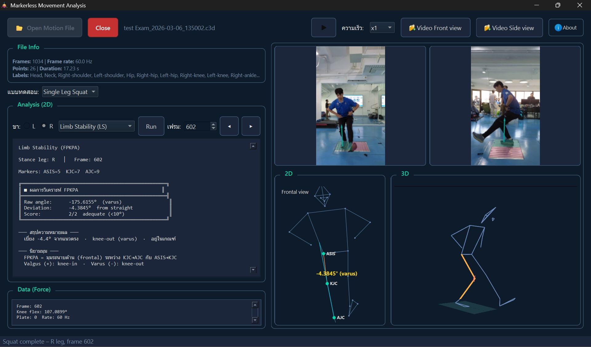
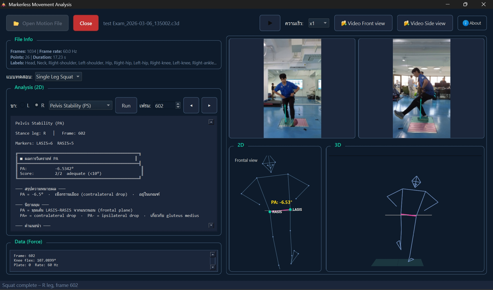
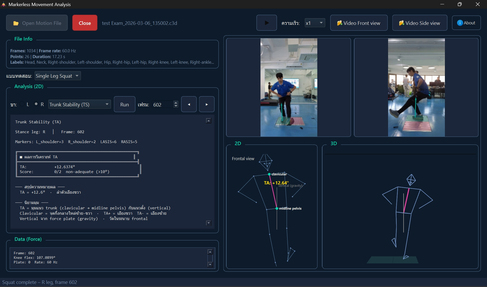
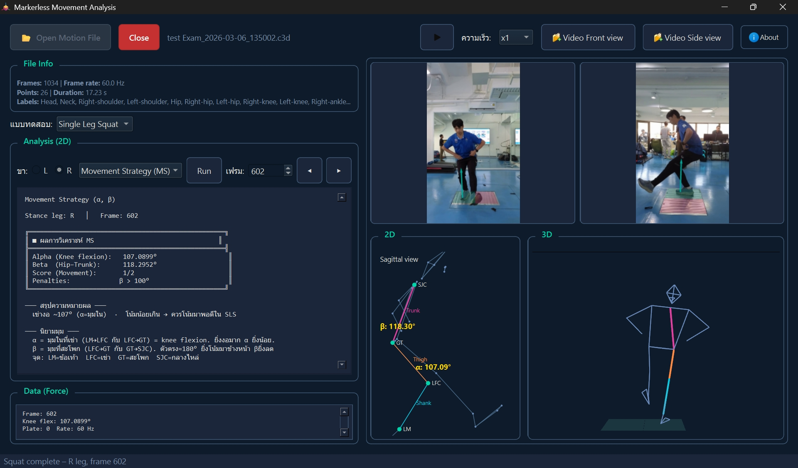

<div align="center">

# Markerless Movement Analysis

โปรแกรมวิเคราะห์ชีวกลศาสตร์จากข้อมูล Markerless Motion Capture และไฟล์ C3D

รองรับการประเมินท่า Single Leg Squat และ Single Leg Hop พร้อมมุมมอง 2D, 3D, force data และวิดีโอประกอบ


</div>

## ภาพรวม

โปรเจกต์นี้พัฒนาขึ้นเพื่อใช้วิเคราะห์การเคลื่อนไหวเชิงชีวกลศาสตร์จากไฟล์ C3D ที่ได้จากระบบ markerless motion capture และอุปกรณ์แผ่นวัดแรง Podium BTS Bioengineering โดยมุ่งเน้นการใช้งานจริงในงานประเมินการเคลื่อนไหว การฝึกฟื้นฟู และงานวิจัย

ตัวโปรแกรมเป็น Desktop Application บน Windows ที่เปิดไฟล์ วิเคราะห์ผล และแสดงผลในหน้าจอเดียว ช่วยให้ดูความสัมพันธ์ของข้อมูลเชิงมุม ข้อมูลแรง วิดีโอ และ skeleton 3D ได้พร้อมกัน

## จุดเด่นของระบบ

- วิเคราะห์ท่า Single Leg Squat และ Single Leg Hop ได้ในแอปเดียว
- รองรับการประเมิน Limb Stability, Pelvis Stability, Trunk Stability, Movement Strategy และ Shock Absorption
- แสดงผลทั้งมุมมอง 2D และ 3D เพื่อช่วยตีความการเคลื่อนไหวได้ชัดขึ้น
- รองรับการเปิดวิดีโอ Front view และ Side view เพื่อเทียบกับข้อมูล motion capture
- แสดง force data ของเฟรมที่เลือก เพื่อเชื่อมโยงค่าทางชีวกลศาสตร์กับเหตุการณ์การเคลื่อนไหว
- ใช้ PySide6 และ PyVista ทำให้ UI ลื่นและรองรับการขยายต่อยอดได้ง่าย
- มีสคริปต์ CLI สำหรับ debug และตรวจสอบไฟล์ C3D เพิ่มเติม

## ความสามารถที่มีในเวอร์ชันปัจจุบัน

| หมวด | รายละเอียด |
|------|-------------|
| File Loading | เปิดไฟล์ `.c3d` และ `.json` สำหรับข้อมูลการเคลื่อนไหว |
| Analysis | LS, PS, TS, MS และ SA ตามชนิดของแบบทดสอบ |
| 2D View | แสดง diagram ของมุม/แนวอ้างอิงในระนาบ frontal หรือ sagittal |
| 3D View | แสดง skeleton 3D พร้อมการเลื่อนเฟรมและ playback |
| Video Sync Support | โหลดวิดีโอด้านหน้าและด้านข้างเพื่อใช้อ้างอิงระหว่างวิเคราะห์ |
| Force Data | กรองและแสดงข้อมูล force plate รวมถึงค่าที่เกี่ยวข้องในเฟรมที่วิเคราะห์ |
| Usability | เปลี่ยนเฟรมแบบละเอียด, เล่นอัตโนมัติ, เลือกข้าง L/R, เลือกชนิดการทดสอบ |

## ตัวอย่างหน้าจอ

<table>
	<tr>
		<td align="center"></td>
		<td align="center"></td>
	</tr>
	<tr>
		<td align="center"></td>
		<td align="center"></td>
	</tr>
</table>

## วิธีติดตั้ง

### ความต้องการเบื้องต้น

- Windows
- Python 3.10 ขึ้นไป
- pip สำหรับติดตั้งแพ็กเกจ

### ติดตั้ง dependencies

```bash
pip install -r requirements.txt
```

แพ็กเกจหลักที่ใช้งานในโปรเจกต์นี้ ได้แก่ `c3d`, `PySide6`, `numpy`, `scipy`, `pyvista`, `pyvistaqt` และ `opencv-python`

## วิธีเริ่มใช้งาน

### รันจาก source code

```bash
python main.py
```

หรือ

```bash
python -m biomech_app
```

### ขั้นตอนใช้งานในโปรแกรม

1. เปิดโปรแกรม
2. กด `Open Motion File` เพื่อเลือกไฟล์ `.c3d` หรือ `.json`
3. เลือกชนิดการทดสอบเป็น `Single Leg Squat` หรือ `Single Leg Hop`
4. เลือกข้างที่ต้องการวิเคราะห์ `L` หรือ `R`
5. เลือกประเภทการวิเคราะห์ แล้วกด `Run`
6. ตรวจดูผลในแผงรายงาน 2D, force data, วิดีโอ และ skeleton 3D

## การ build เป็นไฟล์ .exe

โปรเจกต์มีไฟล์ `build.bat` และ `main.spec` สำหรับ build ด้วย PyInstaller อยู่แล้ว

```bash
build.bat
```

เมื่อ build สำเร็จ ตัวโปรแกรมจะอยู่ในโฟลเดอร์:

```bash
dist\MarkerlessMovementAnalysis\MarkerlessMovementAnalysis.exe
```

## เครื่องมือ CLI ที่มีให้

| คำสั่ง | ใช้สำหรับ |
|--------|-----------|
| `python scripts/analyze_sls.py <file>` | วิเคราะห์ SLS/LS จากไฟล์ C3D หรือ JSON |
| `python scripts/debug_force.py <file.c3d>` | ตรวจสอบข้อมูล force และ COP |
| `python scripts/inspect_c3d.py <file.c3d>` | ตรวจสอบโครงสร้างภายในของไฟล์ C3D |

## โครงสร้างโปรเจกต์

```text
Markerless_Movement-Analysis/
├── main.py
├── build.bat
├── main.spec
├── requirements.txt
├── biomech/
│   ├── c3d_loader.py
│   ├── force_filter.py
│   ├── force_platform.py
│   ├── grf_metrics.py
│   └── sls_analysis.py
├── biomech_app/
│   ├── main_window.py
│   ├── theme.py
│   ├── widgets.py
│   └── workers.py
├── scripts/
│   ├── analyze_sls.py
│   ├── debug_force.py
│   ├── inspect_c3d.py
│   └── README.md
├── Data/
├── c3d/
└── ex1.jpg - ex4.jpg
```

## เทคโนโลยีที่ใช้

- Python
- PySide6
- PyVista + PyVistaQt
- NumPy
- SciPy
- OpenCV
- c3d

## ผู้พัฒนา

พัฒนาโดย Patchara Al-umaree

- Email: Patcharaalumaree@gmail.com
- GitHub: https://github.com/MrPatchara

## License

โปรเจกต์นี้เผยแพร่ภายใต้สัญญาอนุญาต MIT

รายละเอียดอยู่ในไฟล์ [LICENSE](./LICENSE)
